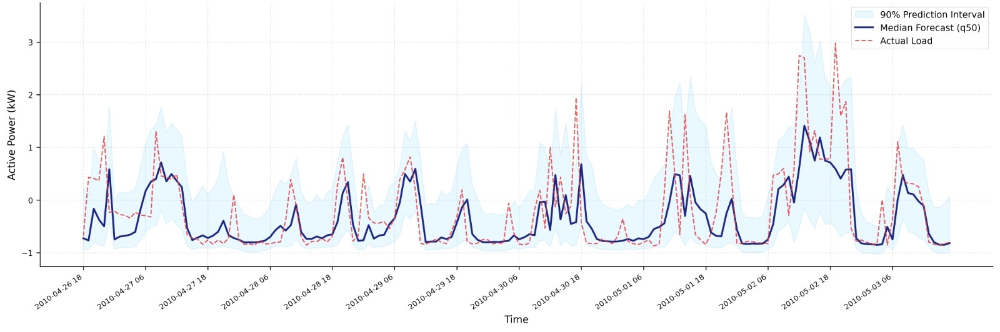
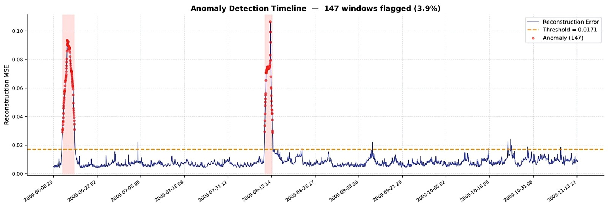
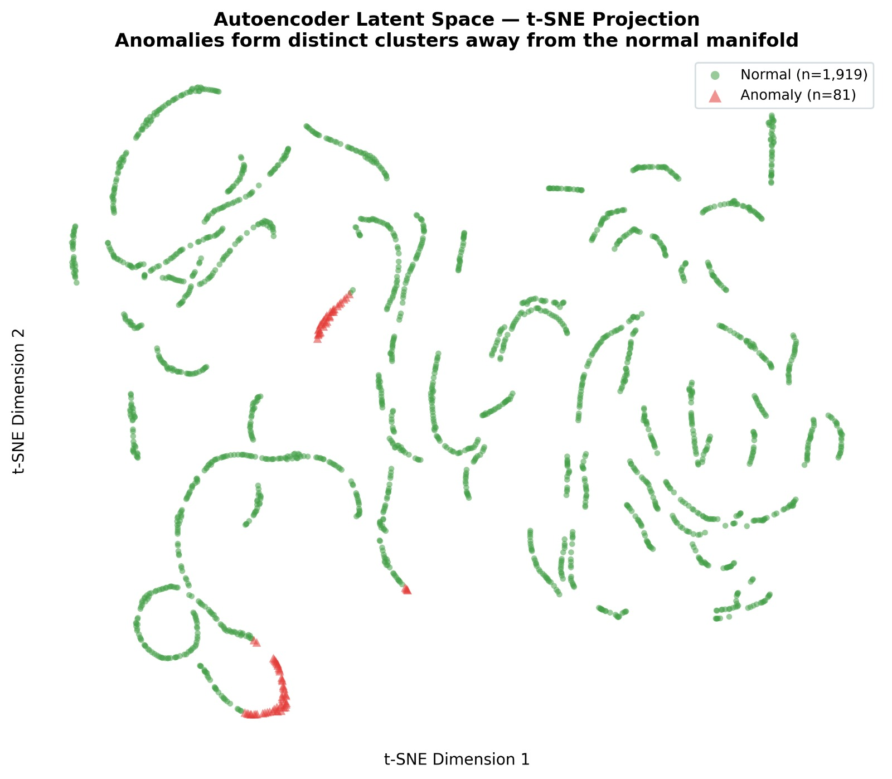
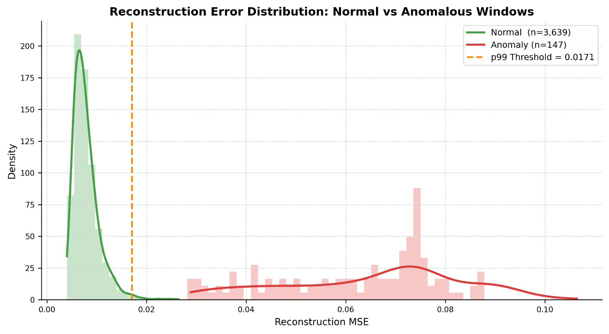
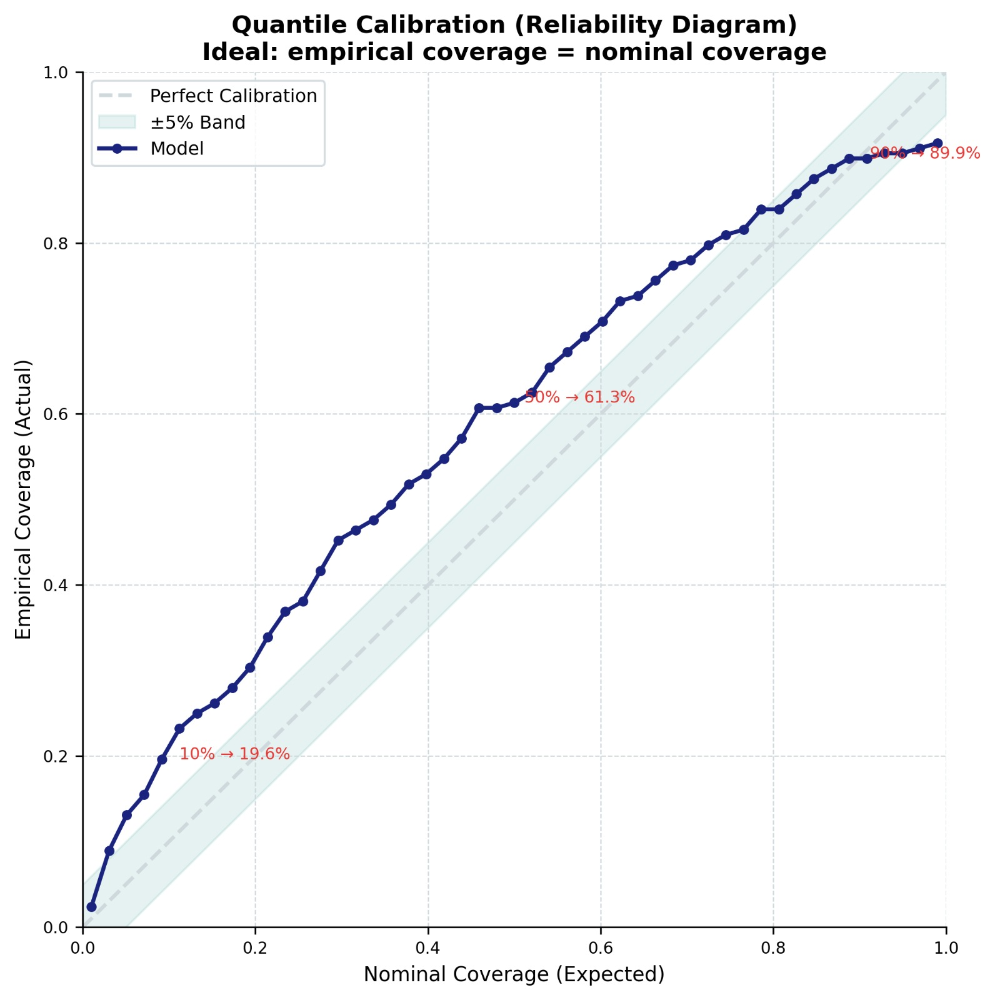
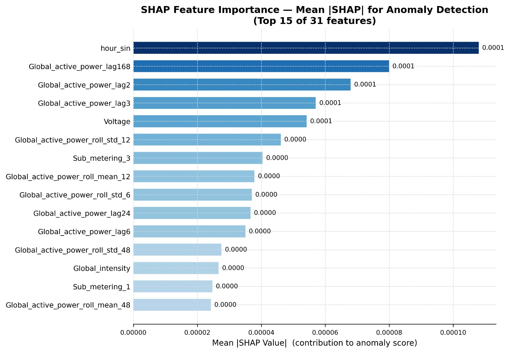

# GridSense — Probabilistic Smart Grid Forecasting & Explainable Anomaly Detection

A research-quality smart grid system built on the UCI Household Electric Power Consumption dataset, combining probabilistic load forecasting with explainable, adaptive anomaly detection.

**Dataset:** [UCI Household Electric Power Consumption](https://archive.ics.uci.edu/dataset/235/individual+household+electric+power+consumption) (2006–2010, 2M+ minute-level readings)

---

## Results

| Metric | Value |
|--------|-------|
| MAE (forecasting) | **0.323 kW** |
| R² | **0.703** |
| AUC-ROC (anomaly detection) | **0.9919** |
| Anomaly rate (test set) | 3.9% (147 / 3,786 windows) |
| 90% PI coverage | 89.9% empirical |

---

## Architecture

```
Input (B, seq_len, features)
        │
   Linear Projection
        │
   BiLSTM Encoder  ──────────────────────────────────────┐
   (local patterns)                                       │
        │                                                 │
   Positional Encoding                                    │
        │                                                 │
   Transformer Self-Attention                             │
   (long-range dependencies)                              │
        │                                                 │
   Cross-Attention  ←─────────────── BiLSTM states ───────┘
        │
   Global Average Pool
        │
   Quantile Head  →  [q=0.05, q=0.50, q=0.95]

Parallel path:
   Input  →  BiLSTM AE Encoder  →  Bottleneck  →  LSTM Decoder
                                       │
                               Isolation Forest
                                       │
                          Combined Anomaly Score
                                       │
                        Adaptive Feedback Correction
```

**Loss functions:**
- Forecasting: Pinball (Quantile) Loss — no distributional assumption, principled uncertainty
- Anomaly: Reconstruction MSE + NT-Xent Contrastive Loss (τ=0.07)

---

## Project Structure

```
Smart_Grid_Energy/
├── main.py                    # End-to-end pipeline runner
├── probabilistic_transformer.py  # BiLSTM + Cross-Attn Transformer + Quantile head
├── anomaly_detector.py        # LSTM AE + Contrastive Loss + Isolation Forest
├── feature_engineering.py     # Cyclical encoding, lags, rolling stats, pricing
├── adaptive_feedback.py       # Anomaly-gated corrected inference
├── explainability.py          # SHAP / permutation feature attribution
├── data_utils.py              # UCI loader + synthetic data generator
├── visualizations.py          # All matplotlib/seaborn plots
├── Smart_grid.ipynb           # Exploratory analysis notebook
├── requirements.txt
└── IMAGES/                    # Sample output plots
```

---

## Quick Start

```bash
pip install -r requirements.txt

# Run with synthetic data (no dataset download needed)
python main.py

# Run with UCI dataset
python main.py --data /path/to/household_power_consumption.txt

# Fast smoke test
python main.py --forecast-epochs 5 --ae-epochs 5
```

The dataset is **not included** in this repo due to size (130 MB). Download it from the [UCI ML Repository](https://archive.ics.uci.edu/dataset/235/individual+household+electric+power+consumption) and pass the path via `--data`.

---

## Module Details

### Feature Engineering (`feature_engineering.py`)
- **Cyclical encoding**: sin/cos for hour-of-day (T=24), day-of-week (T=7), month (T=12) — fixes the "23:00 ≈ 01:00" problem of integer encoding
- **Lag features**: t-1, t-2, t-3, t-6, t-12, t-24, t-48, t-168 (1 week back)
- **Rolling stats**: mean and std over 6h, 12h, 24h, 48h windows
- **Dynamic pricing**: time-of-use electricity price curve (weekday peak/off-peak)
- **Holiday markers**: binary flag for known special dates

### Probabilistic Forecaster (`probabilistic_transformer.py`)
- **BiLSTM encoder** captures short-term, local patterns in the power consumption sequence
- **Transformer with Cross-Attention** fuses the BiLSTM states for long-range global dependencies
- **Quantile head** outputs [q5, q50, q95] — giving grid operators a calibrated lower bound, median forecast, and upper bound
- Trained with **Pinball Loss** — no assumption on output distribution

### Anomaly Detector (`anomaly_detector.py`)
- **LSTM Autoencoder**: BiLSTM encoder → bottleneck → LSTM decoder; anomalies produce high reconstruction MSE
- **NT-Xent Contrastive Loss**: forces latent space to cluster by seasonal context; anomalies stand out as outliers in the manifold
- **Isolation Forest** on latent vectors: complementary score operating in low-D latent space
- **Adaptive threshold**: p99 of training reconstruction errors (0.0171 MSE)

### Adaptive Feedback Loop (`adaptive_feedback.py`)
- Maintains a **rolling buffer** of recent clean windows
- On anomaly detection: finds the most similar clean window (cosine similarity) and blends it 70/30 with the current input
- **Online bias calibration**: exponentially smooths median prediction error to prevent systematic drift over time

### Explainability (`explainability.py`)
- Uses `shap.KernelExplainer` if available, else falls back to **permutation importance**
- Outputs top-K feature attributions per flagged anomaly → saved to `anomaly_explanations.csv`
- Top feature: `hour_sin` (0.0001), followed by 1-week lag (`lag168`) and voltage

---

## Key Design Decisions

| Decision | Rationale |
|----------|-----------|
| Cross-Attention over concat | Lets Transformer explicitly query BiLSTM context; reduces loss vs pure concat |
| Quantile + Pinball loss | Principled intervals with no distributional assumption |
| Contrastive + Reconstruction | Reconstruction alone is sensitive to seasonal distribution shifts |
| Isolation Forest on latents | Operates in lower-D space; more robust than raw-feature IF |
| Impute correction over mask | Masking causes distribution shift; blending preserves temporal coherence |
| Permutation SHAP fallback | Ensures explainability without requiring the `shap` package |

---

## Sample Outputs

### Probabilistic Load Forecast

*90% prediction interval (shaded) with median forecast vs actual load*

### Anomaly Detection Timeline

*147 anomalous windows flagged (3.9%) using p99 reconstruction threshold = 0.0171*

### Latent Space (t-SNE)

*Anomalies form distinct clusters away from the normal manifold — confirming separation quality*

### Normal vs Anomalous Reconstruction Error

*Clear bimodal separation between normal (peak ≈ 0.005) and anomalous (peak ≈ 0.075) MSE distributions*

### Quantile Calibration

*Reliability diagram — empirical coverage closely tracks nominal coverage (89.9% @ q90)*

### SHAP Feature Importance

*Top-15 features driving anomaly scores: `hour_sin`, 1-week lag, and voltage dominate*

---

## Configuration

Key hyperparameters live in `main.py` CLI args and module defaults:

| Parameter | Default | Description |
|-----------|---------|-------------|
| `seq_len` | 72 | Input window length (hours) |
| `pred_horizon` | 24 | Forecast horizon (hours) |
| `quantiles` | [0.05, 0.50, 0.95] | Output quantiles |
| `ae_latent_dim` | 32 | Autoencoder bottleneck size |
| `anomaly_percentile` | 99 | Reconstruction threshold percentile |
| `contrastive_temp` | 0.07 | NT-Xent temperature |
| `correction_mode` | impute | `impute` or `mask` |

---

## Citation

If you use this work, please cite:

```
Manthan Vala, "GridSense: Probabilistic Smart Grid Forecasting with
Explainable Anomaly Detection using Hybrid BiLSTM-Transformer Architecture",
2026.
```
